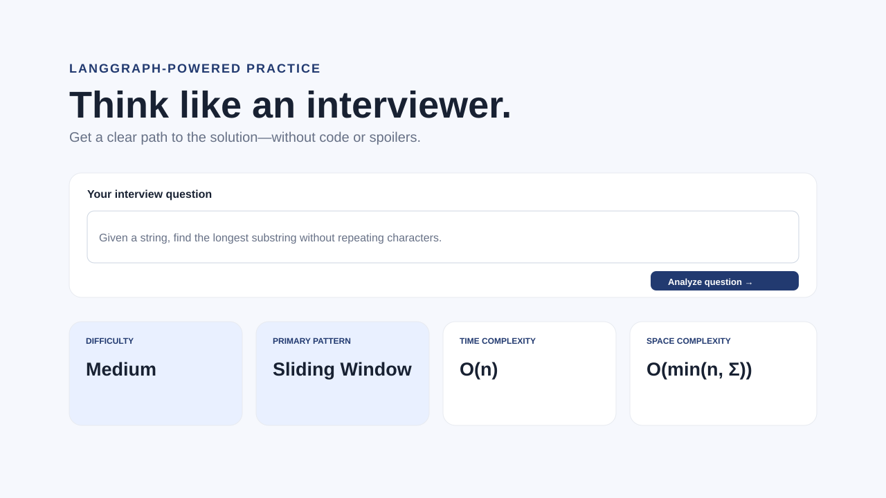

# AI Interview Preparation Assistant

A production-minded DSA interview coach built with FastAPI, LangChain, LangGraph, Pydantic, and Gemini. It guides candidates toward an approach without returning implementation code.



## What it does

For each question, a LangGraph shared state flows through three focused LLM calls and a deterministic formatter:

```text
START → Classification (Difficulty + Pattern)
      → Solution Review (Algorithm + Complexity)
      → Coaching (Hints + Follow-ups) → Python Formatter → END
```

Each LLM node has its own prompt and adds only its result to `InterviewState`. The Python Formatter deterministically validates and assembles those fields without an LLM call. The UI shows the difficulty, primary pattern, high-level algorithm idea, complexity review, exactly three progressive hints, and two interview follow-ups.

## Project structure

```text
app/
  core/                 # Environment settings and logging
  graphs/               # LangGraph state, prompts, nodes, workflow
  models/               # Pydantic API and agent-output contracts
  services/providers/   # Swappable LLM provider adapters
  static/               # Dependency-free CSS and browser JavaScript
  templates/            # HTML served by FastAPI
  main.py               # API and static app entry point
screenshots/            # Dashboard preview
tests/                  # Provider-free contract tests
```

## Setup

1. Install Python 3.11 or newer.
2. Create and activate a virtual environment:

   ```powershell
   python -m venv .venv
   .\.venv\Scripts\Activate.ps1
   ```

3. Install dependencies:

   ```powershell
   pip install -r requirements.txt
   ```

4. Copy the example environment file and set your Gemini key. The Google project behind the key must have Gemini API quota available (a key alone is not sufficient). The template uses `gemini-flash-latest`, because Google can retire version-pinned models for new projects.

   ```powershell
   Copy-Item .env.example .env
   ```

   Edit `.env` and replace `GEMINI_API_KEY=replace_me` with a key from Google AI Studio. `.env` is ignored by Git.

5. Start the application:

   ```powershell
   uvicorn app.main:app --reload
   ```

Open [http://127.0.0.1:8000](http://127.0.0.1:8000). API documentation is at [http://127.0.0.1:8000/docs](http://127.0.0.1:8000/docs).

## API

`POST /api/analyze`

```json
{"question": "Given an array of integers, find the maximum sum of a contiguous subarray."}
```

The API returns `{ "analysis": { ... } }`, with validated fields for the UI. A missing key produces a clear `503`; upstream model problems return `502`; and the configurable `WORKFLOW_TIMEOUT_SECONDS` guard returns `504` rather than leaving a browser request open indefinitely.

## Provider design

`LLMProvider` is a small async interface. `GeminiProvider` is its current implementation, selected with `LLM_PROVIDER=gemini`. To add OpenAI or Ollama, add an adapter implementing `generate(system_prompt, user_prompt)` and register it in `app/services/providers/factory.py`; the graph nodes do not change.

## Quality and safety notes

- Input and each agent result are validated with Pydantic.
- The graph treats question text as untrusted content and asks agents for JSON only.
- Prompts explicitly prohibit code, pseudocode, and full worked answers.
- Logs are structured for server operation and never log API keys.
- Run the provider-free test suite with `pytest -q`.
